# CBFKit: A Control Barrier Function Toolbox for Robotics Applications

CBFKit is a Python/ROS2 toolbox for safe planning and control using Control Barrier Functions (CBFs). Built on JAX for automatic differentiation and JIT compilation, it provides formal safety guarantees for robotic systems operating in deterministic, disturbed, and stochastic environments. It also includes an efficient JAX implementation of Model Predictive Path Integral (MPPI) control with reach-avoid specifications.

<p align="center">
  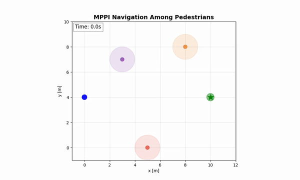
  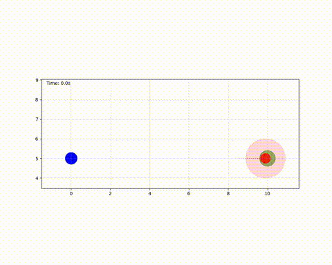
</p>
<p align="center">
  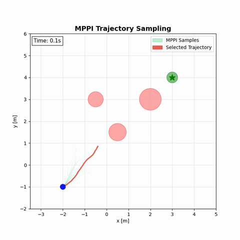
  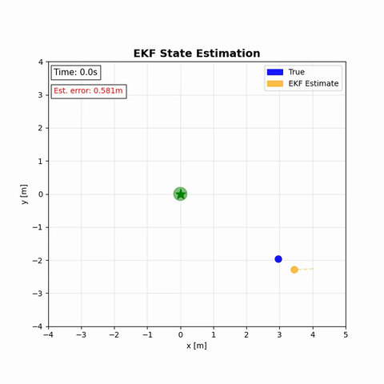
</p>
<p align="center">
  <em>MPPI among pedestrians &nbsp;|&nbsp; CBF head-on safety</em><br>
  <em>MPPI rollout sampling &nbsp;|&nbsp; EKF state estimation</em>
</p>

Supported dynamics: $\dot{x} = f(x) + g(x)u$, $\dot{x} = f(x) + g(x)u + Mw$, $dx = (f(x) + g(x)u)dt + \sigma(x)dw$

## Quick Start

Requires **Python 3.10--3.12**.

```bash
git clone https://github.com/bardhh/cbfkit.git && cd cbfkit
pip install -e .
python examples/unicycle/reach_goal/unicycle_reach_avoid_cbf.py
```

**Minimal example** — unicycle navigating to a goal while avoiding an obstacle with a CBF safety filter:

```python
import jax.numpy as jnp
from jax import jit
from cbfkit.simulation import simulator
from cbfkit.systems.unicycle.models.olfatisaber2002approximate.dynamics import approx_unicycle_dynamics
from cbfkit.certificates import concatenate_certificates, rectify_relative_degree
from cbfkit.certificates.barrier_functions import ellipsoidal_barrier_factory
from cbfkit.certificates.conditions.barrier_conditions.zeroing_barriers import linear_class_k
from cbfkit.controllers.cbf_clf import vanilla_cbf_clf_qp_controller
from cbfkit.integration import runge_kutta_4
from cbfkit.sensors import perfect
from cbfkit.estimators import naive

dynamics = approx_unicycle_dynamics(lam=1.0)  # state: [x, y, theta]

# Nominal controller — drives toward goal
@jit
def nominal_controller(t, state, key, data):
    x, y, th = state
    xg, yg = 4.0, 0.0
    heading = jnp.arctan2(yg - y, xg - x)
    return jnp.array([
        jnp.linalg.norm(jnp.array([x - xg, y - yg])),                         # speed
        jnp.arctan2(jnp.sin(heading - th), jnp.cos(heading - th)),             # steering
    ]), {}

# CBF barrier — obstacle at (2, 0.5) with radius 0.5
cbf_factory, _, _ = ellipsoidal_barrier_factory(
    system_position_indices=(0, 1), obstacle_position_indices=(0, 1), ellipsoid_axis_indices=(0, 1),
)
barrier = rectify_relative_degree(
    function=cbf_factory(jnp.array([2.0, 0.5, 0.0]), jnp.array([0.5, 0.5])),
    system_dynamics=dynamics, state_dim=3, form="exponential",
)(certificate_conditions=linear_class_k(10.0))

# Safety-filtered simulation
controller = vanilla_cbf_clf_qp_controller(
    control_limits=jnp.array([5.0, jnp.pi]),
    dynamics_func=dynamics,
    barriers=concatenate_certificates(barrier),
)
results = simulator.execute(
    x0=jnp.array([0.0, 0.0, 0.0]), dt=0.01, num_steps=500,
    dynamics=dynamics, integrator=runge_kutta_4,
    nominal_controller=nominal_controller, controller=controller,
    sensor=perfect, estimator=naive,
)
print(f"Final position: ({results.states[-1, 0]:.2f}, {results.states[-1, 1]:.2f})")
```

## Showcase

### Highlights

#### Safe RL with Gymnasium

Drop-in CBF safety filter for any continuous Gymnasium environment. Wraps the env so every action from your RL policy gets safety-projected by a CBF-QP before reaching the simulator — works with PPO, SAC, or any off-the-shelf algorithm, no policy retraining required.

<p align="center">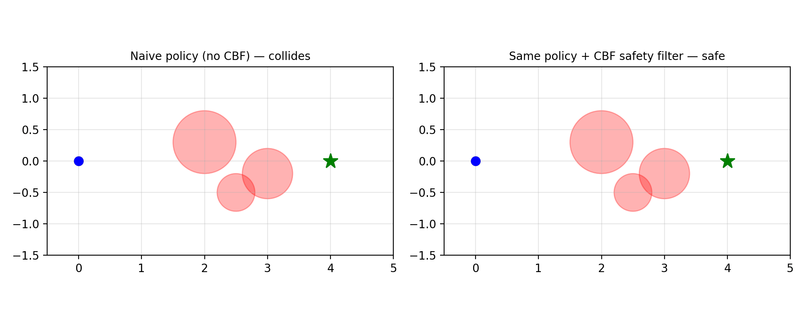</p>

```bash
python examples/gymnasium/safe_single_integrator.py
```

#### Neural CBF — learn barriers from data

Skip the math: learn the barrier function from samples. A small neural network learns h(x) from labeled safe/unsafe states, then plugs straight into CBFKit's CBF-QP controller. Useful when obstacles are hard to describe analytically — point clouds, learned occupancy maps, scanned environments.

<p align="center">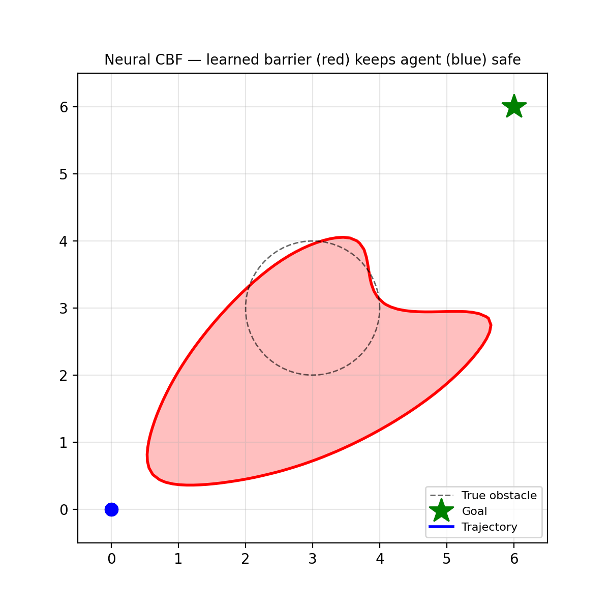</p>

```bash
python examples/neural_cbf/neural_cbf_obstacle_avoidance.py
```

#### ~700-880× faster QP solver

A Mehrotra predictor-corrector primal-dual interior-point QP solver built for CBF-CLF problems. Drop-in replacement for the JAXopt and CVXOPT solvers shipped with CBFKit. Robust on ill-conditioned, slack-relaxed CBF-CLF-QPs that confuse simpler solvers — converges in 10–15 Newton iterations regardless of the slack penalty magnitude. Selected at runtime via `solver=get_solver("fast")` on any CBF-QP controller.

Measured on random PD QPs (50 reps after warmup) on the sizes typical of CBF-CLF safety filtering:

| Size (n×m) | vs JAXopt OSQP | vs CVXOPT |
|------------|---------------:|----------:|
| 2×5        | **880×**       | 81×       |
| 4×10       | **785×**       | 73×       |
| 8×20       | **696×**       | 64×       |

<p align="center">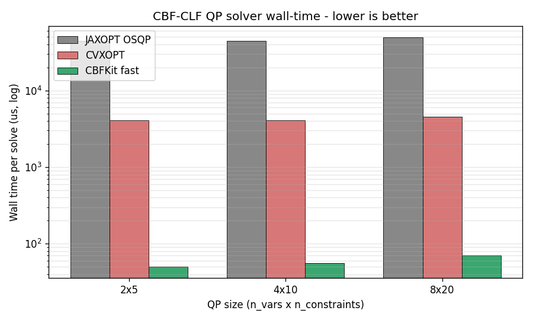</p>

```bash
python benchmarks/qp_solver_comparison.py
```

#### Multi-robot 3D coordination

Cinematic 3D simulation rendering with Manim. Multi-robot reach-avoid in 3D, rendered via CBFKit's Manim backend. Shows the visualization stack scales from quick matplotlib plots to publication-quality 3D animations.

<p align="center">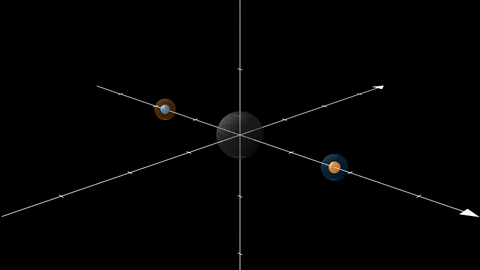</p>

```bash
python tutorials/multi_robot_3d_reachavoid.py
```

### Gallery

<table>
  <tr>
    <td align="center" width="33%">
      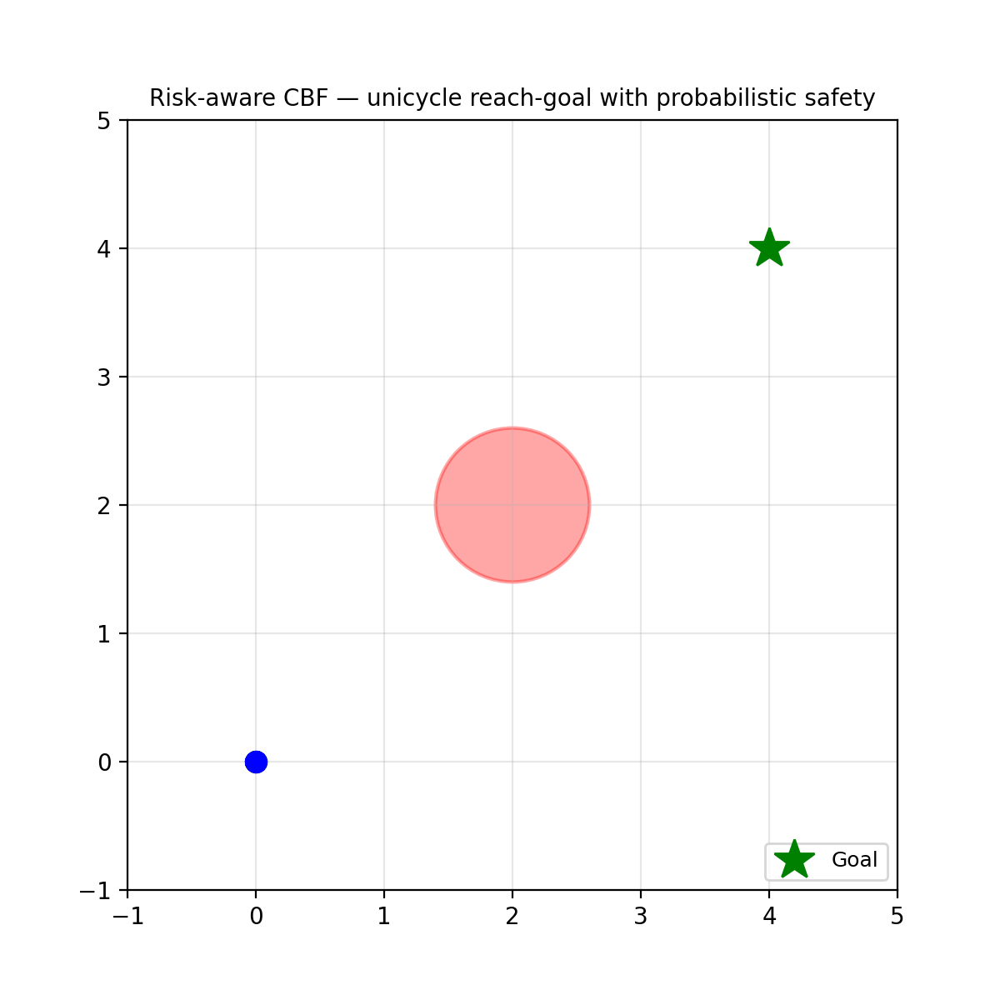<br>
      <sub><b>Ellipsoidal-obstacle CBF</b><br>Unicycle reach-goal with linear class-K</sub>
    </td>
    <td align="center" width="33%">
      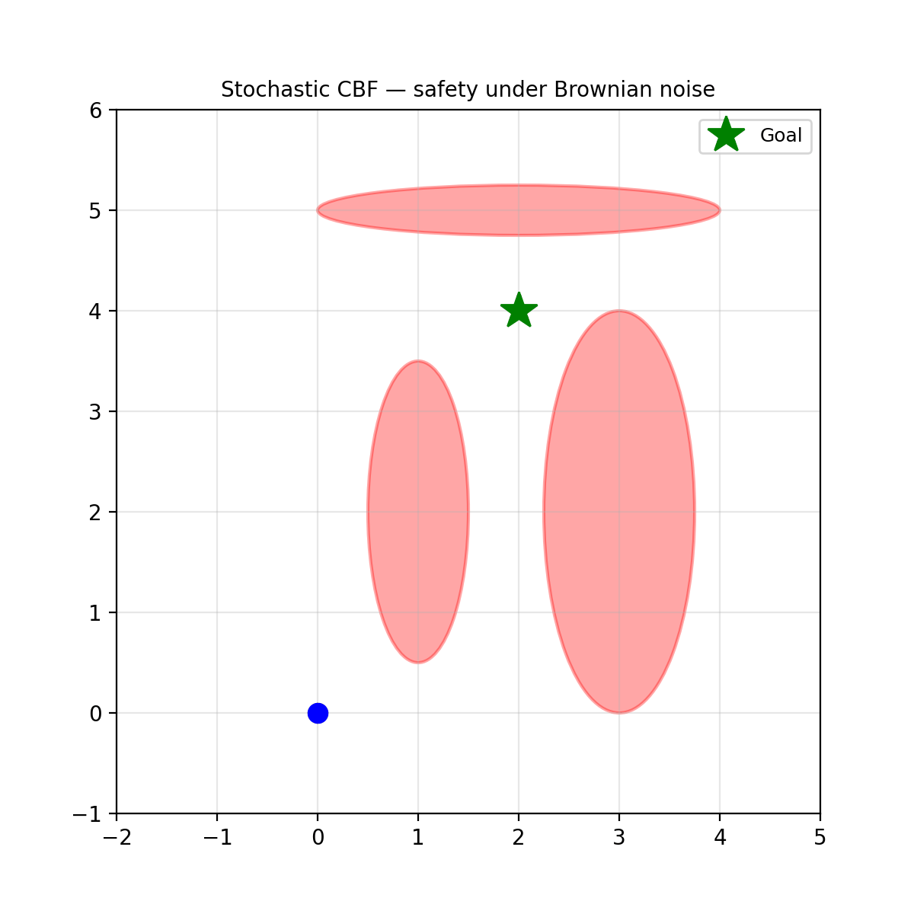<br>
      <sub><b>Stochastic CBF (SDE)</b><br>Safety under Brownian disturbance</sub>
    </td>
    <td align="center" width="33%">
      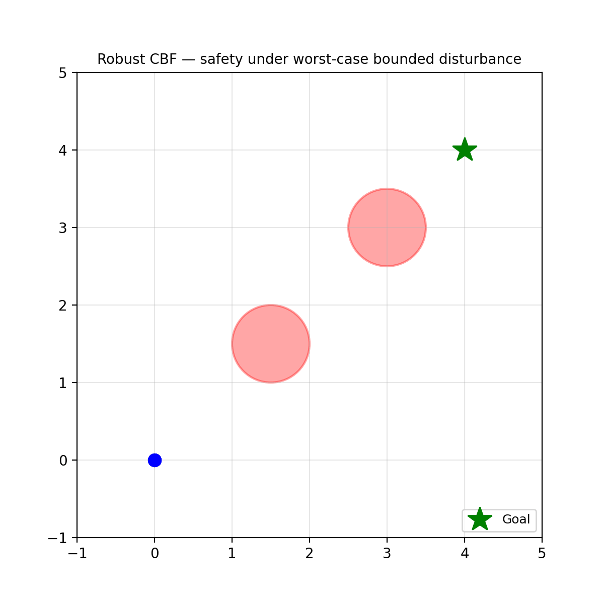<br>
      <sub><b>Robust CBF</b><br>Worst-case bounded disturbance</sub>
    </td>
  </tr>
  <tr>
    <td align="center">
      <br>
      <sub><b>MPPI rollout sampling</b><br>Sampling-based planning</sub>
    </td>
    <td align="center">
      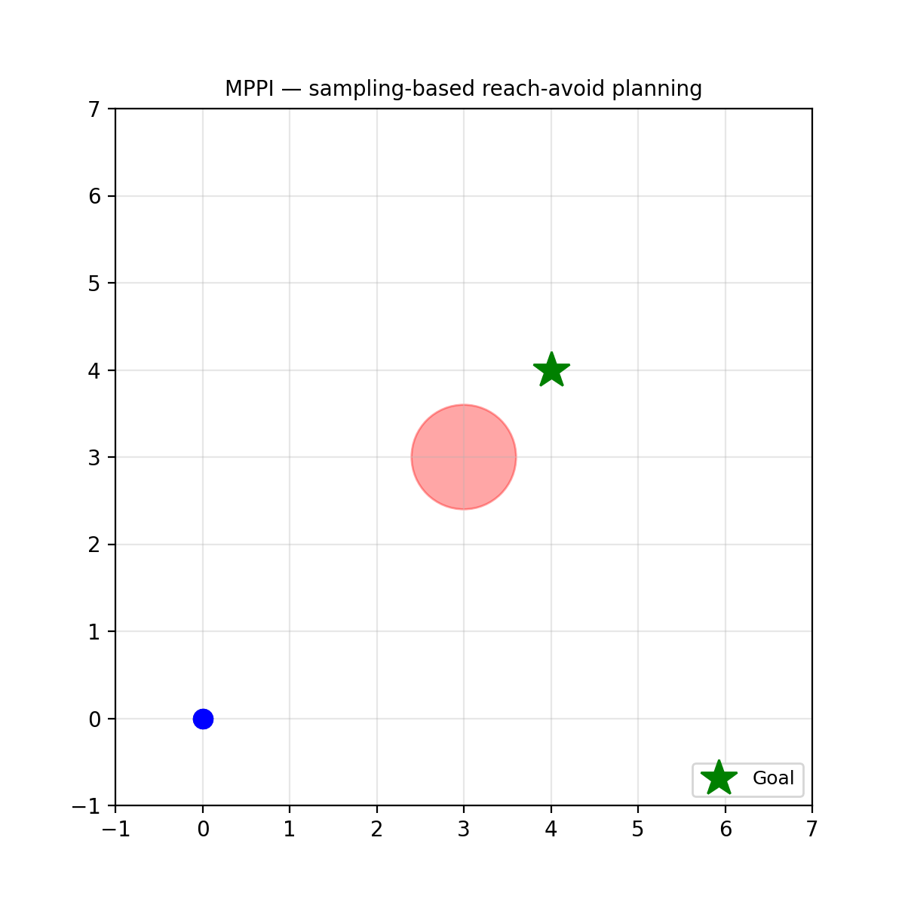<br>
      <sub><b>MPPI reach-avoid</b><br>Sampling-based planning with goal + obstacle cost</sub>
    </td>
    <td align="center">
      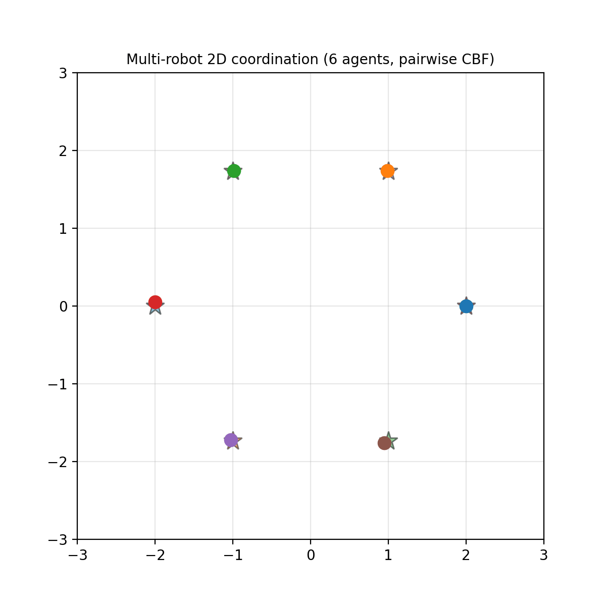<br>
      <sub><b>Multi-robot 2D</b><br>Coordination via shared CBFs</sub>
    </td>
  </tr>
  <tr>
    <td align="center">
      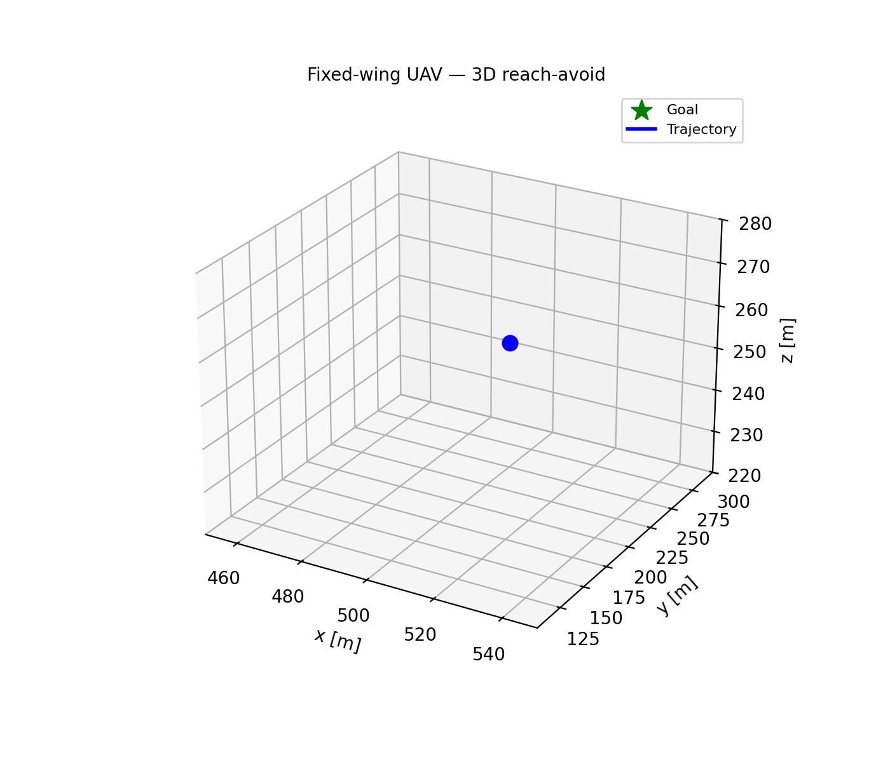<br>
      <sub><b>Fixed-wing aerial 3D</b><br>UAV reach-drop-point in 3D</sub>
    </td>
    <td align="center">
      <br>
      <sub><b>Pedestrian head-on</b><br>Dynamic-agent avoidance</sub>
    </td>
    <td align="center">
      <br>
      <sub><b>EKF state estimation</b><br>CBF over noisy estimates</sub>
    </td>
  </tr>
</table>

*Also available: code generation for custom systems (`tutorials/code_generation_tutorial.ipynb`), ROS2 node generation, risk-aware CVaR-CBF, adaptive CVaR-CBF, parameter sweeps, and quadrotor attitude control.*

## Simulation Architecture


If the planner returns a **control trajectory**, the nominal controller is skipped and the safety controller receives it directly. If the planner returns a **state trajectory**, the nominal controller converts it to a control input first.

Each component is a pure function with a specific signature:

| Component | Signature | Returns |
|-----------|-----------|---------|
| Dynamics | `(x)` | `(f, g)` |
| Nominal controller | `(t, x, key, reference)` | `(u, ControllerData)` |
| Controller (safety filter) | `(t, x, u_nom, key, data)` | `(u, ControllerData)` |
| Planner | `(t, x, u_prev, key, data)` | `(u_traj \| None, PlannerData)` |
| Cost function | `(state, action)` | `cost` |

Legacy controller signatures like `(t, x)` or `(t, x, u_nom)` are adapted automatically by the simulator via `cbfkit.controllers.setup_controller`.

<details>
<summary><strong>Docker</strong></summary>

#### VS Code Dev Container
Open the project in VS Code and reopen in container, choosing the **CBFKit CPU Dev Container** at `.devcontainer/cbfkit-container`.

#### Docker Compose
```bash
docker compose -f .devcontainer/docker-compose.yml build cbfkit
docker compose -f .devcontainer/docker-compose.yml run --rm cbfkit bash
docker compose -f .devcontainer/docker-compose.yml down
```

#### GPU (Linux only)
```bash
docker compose -f .devcontainer/docker-compose.yml --profile gpu build cbfkit_gpu
docker compose -f .devcontainer/docker-compose.yml --profile gpu run --rm cbfkit_gpu bash
```
</details>

## Examples & Tutorials

**Examples** use pre-built systems from `cbfkit.systems` -- no code generation needed:

```bash
python examples/unicycle/reach_goal/unicycle_reach_avoid_cbf.py
python examples/unicycle/reach_goal/mppi_cbf.py
```

See [`examples/README.md`](examples/README.md) for the full list with recommended order.

**Tutorials** demonstrate code generation for custom systems:

| Tutorial | Description |
|----------|-------------|
| `code_generation_tutorial.ipynb` | Generate dynamics, controllers, and certificates for a Van der Pol oscillator |
| `multi_robot_coordination.ipynb` | Multi-robot CBF coordination with code generation |
| `mppi_cbf_reach_avoid.py` | MPPI + CBF for unicycle reach-avoid |
| `mppi_stl_reach_avoid.py` | MPPI with STL specifications |
| `single_integrator_dynamic_obstacles.py` | Dynamic obstacle avoidance |

> Tutorials require the `codegen` dependencies (included in the default install).

## ROS2

CBFKit generates ROS2 nodes for plant, controller, sensor, and estimator via the code generation pipeline. See the `ros2/` directory in any generated model for the node scripts.

## Citing CBFKit

If you use CBFKit in your research, please cite the following [paper](https://arxiv.org/abs/2404.07158):
```bibtex
@misc{black2024cbfkit,
  title={CBFKIT: A Control Barrier Function Toolbox for Robotics Applications},
  author={Mitchell Black and Georgios Fainekos and Bardh Hoxha and Hideki Okamoto and Danil Prokhorov},
  year={2024},
  eprint={2404.07158},
  archivePrefix={arXiv},
  primaryClass={cs.RO}
}
```

## License

BSD 3-Clause. See [`LICENSE`](LICENSE).
